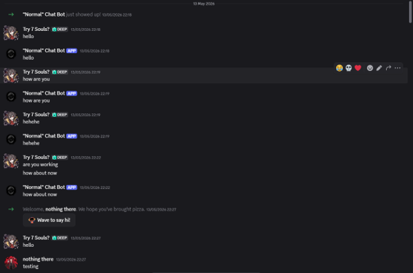
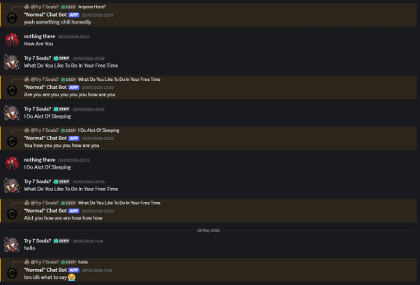
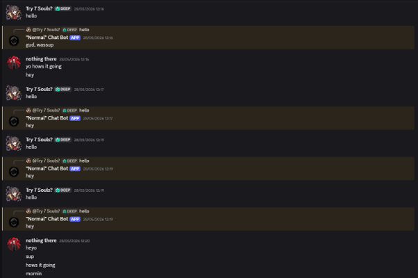
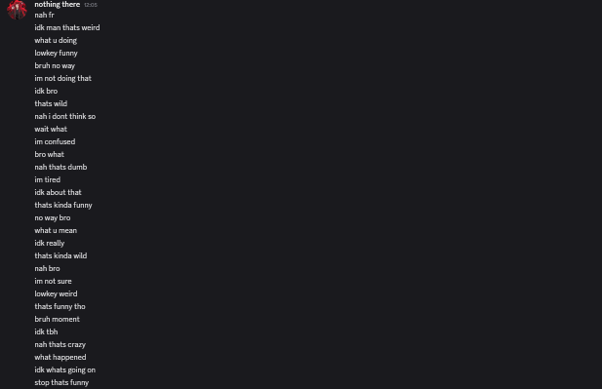
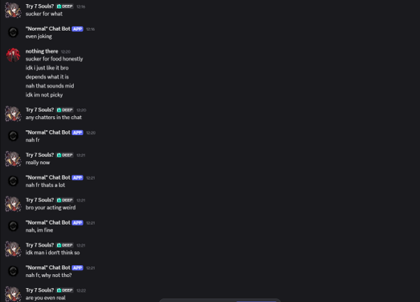

# MDDN242 Project 3 - Skinwalker Bot
## Overview
This project explores how the use of ai can be used to mimic human identify through language. My goal is to create a discord bot that will observe user messages and gradually imitate their tone, vocabulary and style. Over time the bot will produce messages that are near identical to the people being mimicked. Eventually it will become difficult to distinguish which is which, creating an unsettling overlap between each other. To target to you want to mimic you will have to put down the persons discord id into the code.
## Concept
The Skinwalker Bot is designed to feel unsettling rather than purely functionals. It shows how Ai is trained on human data to replicate behaviour on its own. By slowly adopting the voice of users, the project highlights how identity online can just be reduced to just data that can be learned. 

## AI Use
Microsoft Copilot was my primary development tool throughout the project, where I communicated my ideas through prompts. It helped shape the overall structure of my program by generating code and assisting with the implementation of new features. Ai was also used to help trouble shoot problems as well.

## How it Works
### Data Collection
The bot will observe and record user messages: 
-  	Common phrases and vocabulary 
- 	Emojis and sayings
- 	Sentence structure and tone
### Mimic
The bot will generate messages by altering messages that have been recorded:
- 	Replacing keywords
- 	Combining parts from different messages 
- 	Reusing sentence tones 
### Impersonation
The bot will be start posting messages independently that still resembles the way that people talks:
- 	Mimic specific individuals 
- 	Blend traits together
- 	Produce messages that users think are from a real person

## Research
This project is inspired by an existing work from an open-source project mimicbot from cake crusher. Mimicbot is designed to imitate a person’s manner of speech by collecting the user data and generating a response that reflects the persons tone and style. (created with python). My plan is to create something like this, but I want to improve this to point where you can’t tell which is the ai and is the person.

https://github.com/CakeCrusher/mimicbot

## Other things I’m Thinking About
- 	Identifying pattern recognition
- 	Converting language as data
- 	The unsettling effect of almost human communication
- 	AI being a social system
- 	How am I going to build this (most comfortable with js,html,css)
- 	How will the bot slowly learn overtime

## Success Criteria 
### Consistency Over Time
The bot maintains a stable and recognisable writing style as it continues to process information:

**Grading:**
- 	A: Style becomes more consistent and clearly identifiable over time 
- 	B: Mostly consistent with minor variation 
- 	C: Some consistency but noticeable randomness 
- 	D/E: No clear identity or becomes inconsistent
### Measure the Accuracy
The bot accurately replicates the specific user’s way of communicating.

**Grading:**
- 	A: Highly indistinguishable to the real persons messages
- 	B:  Mostly Indistinguishable
- 	C: Soft of Indistinguishable
- 	D/E: Is not indistinguishable
### System Function
The bot operates without breaking, system works in discord.

**Grading:**
- 	A: All features are working and stable
- 	B: All features working with minor bugs 
- 	C: Most features working but inconsistent 
- 	D/E: Major parts missing or breaking
### Degree of Uncertainty
The bot creates confusion between human and AI identity.

**Grading:**
- 	A: Frequent uncertainty
- 	B: Occasional uncertainty
- 	C: Some uncertainty but mostly obvious
- 	D/E: Clearly distinguishable between each other
### Ability to Successfully Test and Learn from the Experience 
Create an environment that is used to test the bot and use that knowledge to improve the experience 
 
**Grading:**
- 	A: Testing resulted in a huge improvement
- 	B: Testing resulted in improvement
- 	C: Testing resulted in little improvement
-   D/E: Testing didn’t improve

## Project Timeline
### Week 1 – Setup / Thinking
- 	Planning what to do
### Week 2 – Setup / Thinking
- 	Implement message logging
- 	store message data
- 	start identifying patterns
- 	start process document
### Week 3 – Core Function
- 	Make the bot generate its own messages 
- 	Replace keywords 
- 	Combine sentences together
- 	Tracking style and tone
### Week 4 – Refinement
- 	Improve behaviour
- 	Produce messages that are more human 
- 	Test data collected 
- 	Messages are not copy and paste
### Last Week – Testing / Polish
- 	Testing
- 	Polish
- 	Fixing Issues

## Progress 
**13.05.2026**

I began by learning how to set up a Discord bot by following a step-by-step YouTube tutorial. This involved creating the bot through the Discord Developer Portal, adjusting settings to define its permissions and purpose, and generating a token key and invite link to add the bot to a server. After installing Node.js, I used Visual Studio Code to install the discord.js package and connected the bot using the token. I then used Microsoft Copilot to generate a simple system where the bot repeats whatever a user says.
 

**20.05.2026**

The next step was to move beyond simple repetition and make the bot generate responses. At this stage, I wasn’t sure how to achieve that, so I experimented by having the bot store all messages from the server and respond using that data. The goal was for the bot to gradually identify patterns, such as frequently used words or stylistic choices like capitalising each word. However, the results showed that the bot could not recognise these patterns effectively. Instead, it randomly selected words from the database, often producing incoherent sentences. 

**28.05.2026**

I realised that the bot lacked any understanding of meaning, such as how to respond appropriately to a message like “hello.” To address this, I integrated an free OpenAI API to assist with generating more contextually relevant responses. While the model I used was limited, it provided a foundation for improving interaction quality. I also added a feature to target specific users for mimicry. This involved enabling Discord’s developer mode, copying a user’s ID, and inserting it into the configuration of the code. The bot could then learn from that user’s messages and respond to others in a similar style. During this stage, I encountered multiple technical issues, and Microsoft Copilot was helpful for troubleshooting.
 

**8.06.2026**

In the final week, I focused on testing and refining the system. This involved adding 50–100 phrases into the database, evaluating the bot’s responses and adjusting code parameters or introducing new rules. This iterative process helped improve performance, although results were still abit inconsistent.
 

## End Result
Overall, the system is functional but not perfect. There are still instances where the bot produces unrealistic or irrelevant responses. Key areas for improvement include using a more advanced (paid) OpenAI model and expanding the dataset to improve the bot’s ability to mimic human-like communication.
My project timeline was initially well-paced, but I struggled during the final two weeks due to technical challenges and dead ends, which affected my motivation and progress.
Self-Evaluation of Success Criteria:
- 	Consistency Over Time: B
- 	Accuracy of Mimicry: B
- 	System Functionality: A
- 	Degree of Uncertainty: C
- 	Ability to Test and Learn: C
